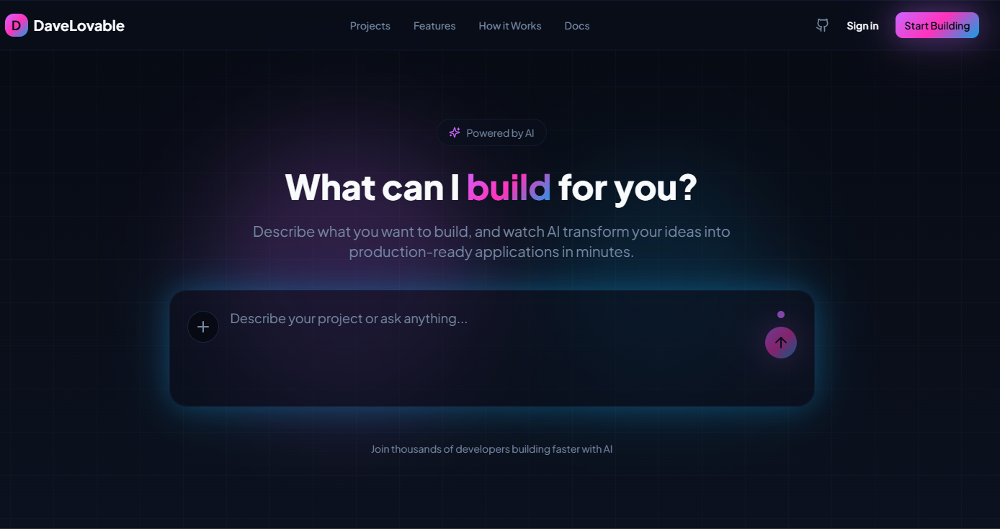
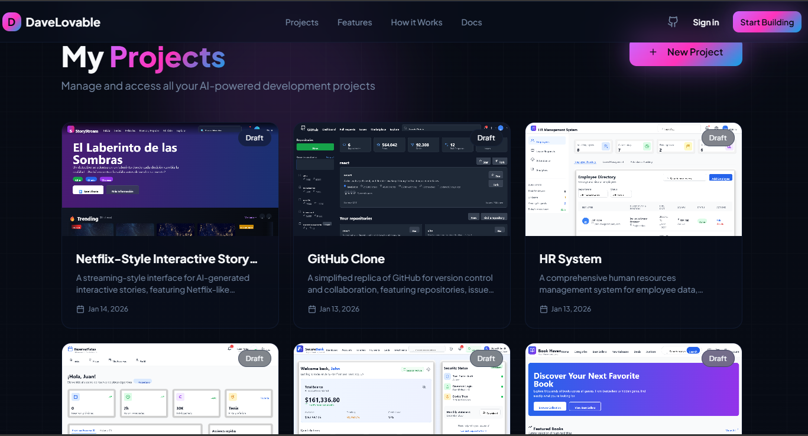

# DaveLovable

<div align="center">

**The Most Advanced Open-Source AI Web Development Platform**

*Build React applications at lightning speed with AI-powered multi-agent orchestration*

[](LICENSE)
[](https://react.dev)
[](https://www.typescriptlang.org)
[](https://fastapi.tiangolo.com)
[](https://microsoft.github.io/autogen)

[Features](#-key-features) • [Demo](#-screenshots) • [Getting Started](#-quick-start) • [Architecture](#-architecture) • [Documentation](#-documentation)



</div>

---

## 🏆 Gemini 3 Hackathon Submission

This project was created for the **[Gemini 3 Global Hackathon](https://gemini3.devpost.com/)** hosted by Google DeepMind and Devpost. The hackathon challenges developers to build next-generation applications using the Gemini 3 model family's enhanced reasoning capabilities, multimodal experiences, and reduced latency.

**DaveLovable** showcases Gemini 3's power through:

- 🧠 **Multi-agent orchestration** with 40+ tools for intelligent code generation
- 🎨 **Multimodal understanding** - upload design mockups and PDFs
- ⚡ **Massive context window** - 1M input tokens for complex projects
- 🚀 **Blazing-fast responses** - 64K output tokens for complete applications
- 💡 **Advanced reasoning** - strategic planning and adaptive problem-solving


---

## 🚀 What is DaveLovable?

**DaveLovable** is an open-source AI-powered web development platform inspired by [Lovable.dev](https://lovable.dev), [v0 by Vercel](https://v0.dev), and [Stitch by Google Labs](https://labs.google/stitch). It combines cutting-edge AI orchestration with browser-based execution to deliver the most advanced open-source alternative for rapid frontend prototyping.

Unlike other tools, DaveLovable leverages:
- **Multi-agent AI orchestration** (Microsoft AutoGen 0.7) with 40+ tools
- **Google Gemini-3 Flash Preview** (1M input tokens, 64K output) for blazing-fast code generation
- **WebContainers** (StackBlitz) for true Node.js runtime in the browser
- **Visual editor mode** with click-to-edit and drag-to-adjust controls
- **Full Git version control** with LLM-generated commit messages
- **Real-time streaming** of agent thought processes

**Focus:** Frontend-only development (React + TypeScript + Tailwind CSS). No backend code generation.


## 🎬 Demo Videos

### 🚀 Full Platform Overview (2-3 minutes)
[

- Quick intro: "Build React apps with AI in minutes"
- Create new project from landing page
- AI generates initial landing page (show chat → agent execution → preview)
- Quick code edit in Monaco editor
- Switch between different device previews (mobile, tablet, desktop)

---

### 🎨 Visual Editor Mode


Visual editing mode in action - click elements directly in the preview, modify styles in real-time with the style panel, and see changes instantly reflected in both the preview and code. Switch to custom prompt mode to use AI for complex style transformations.

---

### 📦 Git Version Control & Time Travel


Built-in version control with complete commit history, diff viewer, and time-travel functionality. Every AI-generated change creates a commit with descriptive messages. Restore to any previous version instantly.

---

### ⚡ Editor & Live Preview


The main editor interface featuring Monaco code editor with syntax highlighting, multi-file management, and live preview powered by WebContainers. True Node.js running in your browser with instant HMR updates and responsive device modes.

---

### 🖼️ Multimodal Input


Upload design mockups, screenshots, or PDFs and ask the AI to recreate them. The AI understands images and documents, extracting layouts, styles, and data to generate accurate React components.

---


## 🏆 Comparison: DaveLovable vs. Competitors

| Feature | DaveLovable | Lovable.dev | v0 (Vercel) | Stitch (Google) |
|---------|-------------|-------------|-------------|-----------------|
| **Open Source** | ✅ MIT License | ❌ Proprietary | ❌ Proprietary | ❌ Proprietary |
| **Multi-Agent System** | ✅ 2 agents (Planner + Coder) | ❌ Single agent | ❌ Single agent | ❌ Single agent |
| **Agent Tools** | ✅ 40+ tools (filesystem, git, terminal, web) | ⚠️ Limited | ⚠️ Limited | ⚠️ Limited |
| **Visual Editor** | ✅ Click-to-edit + drag controls | ❌ Text-based only | ❌ Text-based only | ⚠️ Limited |
| **WebContainer Execution** | ✅ Browser-based Node.js | ❌ Server-side preview | ❌ Server-side preview | ⚠️ Unknown |
| **Git Version Control** | ✅ Full git workflow + history | ❌ No git | ❌ No git | ❌ No git |
| **LLM-Generated Commits** | ✅ Auto-generated from diffs | ❌ N/A | ❌ N/A | ❌ N/A |
| **Gemini-3 Flash** | ✅ 1M input tokens | ❌ Claude/GPT-4 | ❌ GPT-4 | ✅ Gemini (likely) |
| **State Persistence** | ✅ Per-project agent memory | ⚠️ Session-based | ⚠️ Session-based | ⚠️ Unknown |
| **Real-Time Streaming** | ✅ SSE with agent interactions | ⚠️ Polling-based | ⚠️ Polling-based | ⚠️ Unknown |
| **Multimodal Input** | ✅ Images + PDFs | ✅ Images | ✅ Images | ⚠️ Unknown |
| **Backend Generation** | ❌ Frontend-only | ✅ Full-stack | ✅ Full-stack | ⚠️ Unknown |
| **Authentication** | ⚠️ In progress | ✅ Full auth | ✅ Full auth | ✅ Full auth |
| **Deployment** | ⚠️ Manual | ✅ Vercel/Netlify | ✅ Vercel | ✅ Google Cloud |

**Legend:** ✅ Full support • ⚠️ Partial/In progress • ❌ Not supported


---

## 📸 Example Projects Built with DaveLovable

DaveLovable can generate complete, production-ready React applications in minutes. Here are some examples:

### Project Management Dashboard



Multi-project workspace where you can manage all your AI-generated applications. Each project includes full Git history, file management, and live preview capabilities.

---

### Social Media Platform (Facebook Clone)


A fully functional social media platform with modern UI, built entirely by AI in minutes. Features include responsive design, component-based architecture, and Tailwind CSS styling.

**Generated features:**

- News feed layout
- Post components with interactions
- Navigation sidebar
- Responsive design for mobile/tablet/desktop
- Modern UI with gradients and shadows

---

### Real Estate Rental Platform


Complete rental property marketplace application with search, filters, and property listings. Demonstrates AI's ability to create complex, multi-section layouts.

**Generated features:**

- Property search and filters
- Card-based listing layouts
- Hero sections with CTAs
- Responsive grid systems
- Professional color schemes

---

## 🚀 Quick Start

### Prerequisites
- **Node.js:** 18+ (for frontend)
- **Python:** 3.8+ (for backend)
- **Git:** Latest version
- **Google AI API Key:** Get from [Google AI Studio](https://aistudio.google.com/apikey)

### Installation

#### 1. Clone the repository
```bash
git clone https://github.com/davidmonterocrespo24/DaveLovable.git
cd DaveLovable
```

#### 2. Backend Setup
```bash
cd backend

# Create virtual environment
python -m venv venv

# Activate virtual environment
# Windows:
venv\Scripts\activate
# Linux/Mac:
source venv/bin/activate

# Install dependencies
pip install -r requirements.txt

# Configure environment
cp .env.example .env
# Edit .env and add your GOOGLE_API_KEY

# Initialize database
python init_db.py
```

#### 3. Frontend Setup
```bash
cd ../front

# Install dependencies
npm install
```

#### 4. Run the Application

**Terminal 1 - Backend:**
```bash
cd backend
python run.py
# Backend runs on http://localhost:8000
# API docs: http://localhost:8000/docs
```

**Terminal 2 - Frontend:**
```bash
cd front
npm run dev
# Frontend runs on http://localhost:8080
```

#### 5. Open in Browser
Navigate to [http://localhost:8080](http://localhost:8080) and start building!

---

## 📖 Documentation

### Environment Variables

Create `backend/.env` with the following variables:

```env
# Required: Google AI API Key (get from https://aistudio.google.com/apikey)
GOOGLE_API_KEY=your_google_api_key_here

# Optional: JWT Configuration (not fully implemented)
SECRET_KEY=your_secret_key_here_change_in_production
ALGORITHM=HS256
ACCESS_TOKEN_EXPIRE_MINUTES=30

# Optional: Database (defaults to SQLite)
DATABASE_URL=sqlite:///./davelovable.db

# Optional: Debug mode
DEBUG=True

# Optional: AutoGen Configuration
AUTOGEN_MAX_ROUND=20
```

---

##  Architecture

```
┌─────────────────────────────────────────────────────────┐
│                      FRONTEND                           │
│  React + TypeScript + Vite + Tailwind + shadcn/ui      │
│                                                         │
│  ┌──────────────┐  ┌──────────────┐  ┌──────────────┐ │
│  │ Monaco Editor│  │ Chat Panel   │  │ Visual Editor│ │
│  │ (Code Edit)  │  │ (AI Chat)    │  │ (Click-Edit) │ │
│  └──────────────┘  └──────────────┘  └──────────────┘ │
│                                                         │
│  ┌─────────────────────────────────────────────────┐  │
│  │   WebContainer Preview (Node.js in Browser)     │  │
│  │   - Vite Dev Server                             │  │
│  │   - HMR (Hot Module Replacement)                │  │
│  │   - Screenshot Capture (html2canvas)            │  │
│  │   - Visual Editor Helper (element selection)    │  │
│  └─────────────────────────────────────────────────┘  │
└─────────────────────────────────────────────────────────┘
                           │ REST API (SSE for chat)
                           ▼
┌─────────────────────────────────────────────────────────┐
│                      BACKEND                            │
│          FastAPI + SQLAlchemy + SQLite                  │
│                                                         │
│  ┌────────────────────────────────────────────────┐   │
│  │  Multi-Agent System (Microsoft AutoGen 0.7)    │   │
│  │                                                 │   │
│  │  ┌─────────────────┐  ┌────────────────────┐  │   │
│  │  │ Planner Agent   │  │    Coder Agent     │  │   │
│  │  │ (Strategy)      │─▶│  (Execution)       │  │   │
│  │  │ No Tools        │  │  40+ Tools         │  │   │
│  │  └─────────────────┘  └────────────────────┘  │   │
│  │           │                    │               │   │
│  │           ▼                    ▼               │   │
│  │  ┌──────────────────────────────────────┐     │   │
│  │  │ SelectorGroupChat (Smart Routing)     │     │   │
│  │  │ - Visual Edit: Direct to Coder        │     │   │
│  │  │ - Bug Fix: Direct to Coder            │     │   │
│  │  │ - Complex: Planner → Coder            │     │   │
│  │  └──────────────────────────────────────┘     │   │
│  └────────────────────────────────────────────────┘   │
│                                                         │
│  ┌────────────────────────────────────────────────┐   │
│  │       Gemini-3 Flash (Google AI)                │   │
│  │  - 1M input tokens, 64K output tokens           │   │
│  │  - Custom thought_signature client              │   │
│  │  - HTTP-level interception for function calls   │   │
│  └────────────────────────────────────────────────┘   │
│                                                         │
│  ┌────────────────────────────────────────────────┐   │
│  │         Physical File System                    │   │
│  │  backend/projects/project_{id}/                 │   │
│  │  ├── .git/           (version control)          │   │
│  │  ├── package.json    (dependencies)             │   │
│  │  ├── vite.config.ts  (build config)             │   │
│  │  ├── src/            (source files)             │   │
│  │  └── .agent_state.json (agent memory)           │   │
│  └────────────────────────────────────────────────┘   │
└─────────────────────────────────────────────────────────┘
```

### Multi-Agent Workflow

```
User Request
    │
    ▼
┌─────────────────────────────────┐
│   SelectorGroupChat Router       │
│   (Analyzes request context)     │
└─────────────────────────────────┘
    │
    ├─── [VISUAL EDIT] tag? ──────────► Coder Agent (Direct)
    │
    ├─── [BUG FIX] tag? ──────────────► Coder Agent (Direct)
    │
    └─── Complex task? ───────────────► Planner Agent
                                            │
                                            ▼
                                    ┌───────────────────┐
                                    │  Planner thinks   │
                                    │  Creates task list│
                                    └───────────────────┘
                                            │
                                            ▼
                                       Coder Agent
                                            │
                                            ▼
                                    ┌───────────────────┐
                                    │  Executes tools:  │
                                    │  - write_file     │
                                    │  - edit_file      │
                                    │  - run_terminal   │
                                    │  - git commit     │
                                    └───────────────────┘
                                            │
                                            ▼
                                    Files written to disk
                                            │
                                            ▼
                                    Git auto-commit
                                            │
                                            ▼
                                    Frontend syncs to WebContainer
                                            │
                                            ▼
                                    Preview updates (HMR)
```

---

## 🎯 Use Cases

### ✅ Perfect For:
- **Rapid Prototyping:** Build React apps in minutes with AI assistance
- **UI/UX Exploration:** Iterate on designs with visual editor + AI
- **Learning React:** AI explains code and best practices
- **Component Libraries:** Generate reusable components quickly
- **Landing Pages:** Create marketing pages with Tailwind CSS
- **Dashboards:** Build admin panels and data visualizations
- **Portfolio Projects:** Showcase your work with AI-generated code

### ❌ Not Suitable For:
- **Backend Development:** No API/database/server code generation
- **Production Applications:** Authentication and deployment features in progress
- **Large Teams:** No real-time collaboration (single-user only)
- **Enterprise Apps:** No multi-tenancy or advanced security features

---

## 📄 License

This project is licensed under the **MIT License** - see the [LICENSE](LICENSE) file for details.

---
